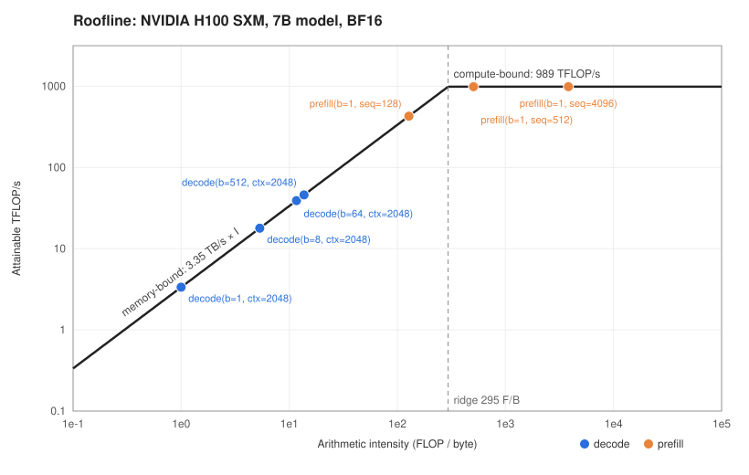

# roofline-model

A small roofline performance model for LLM inference. Given an accelerator's peak
compute and memory bandwidth, it estimates whether a workload (decode step, prefill)
is compute- or memory-bound, its attainable throughput, and a lower-bound latency.

```
attainable FLOP/s = min(peak FLOP/s, arithmetic_intensity × memory_bandwidth)
ridge point       = peak FLOP/s / memory_bandwidth
```

## Layout

```
src/roofline/
  hardware.py   accelerator specs (A100, H100, H200, MI300X)
  model.py      roofline math + decode/prefill FLOP & byte estimates
  cli.py        `roofline` command
  plot.py       optional matplotlib chart
tests/          pytest suite
```

## Build & run

```bash
python3 -m venv .venv
source .venv/bin/activate
pip install -e ".[dev,plot]"
pytest -q
roofline --hw h100-sxm --params 7e9 --batch 1 8 32 128 512 --ctx 2048
roofline --phase prefill --batch 1 8 --ctx 4096 --plot roofline.png
```

Build a wheel:

```bash
pip install build && python -m build
```

## H100 walkthrough

[`examples/h100_roofline.py`](examples/h100_roofline.py) walks through the model step by step
(ridge point, roof, decode/prefill workloads) and draws the chart below with no dependencies:

```bash
PYTHONPATH=src python3 examples/h100_roofline.py
```



## Python API

```python
from roofline import HARDWARE, analyze, decode_step

k = decode_step(7e9, batch=32, context_len=2048, n_layers=32, d_model=4096)
r = analyze(k, HARDWARE["h100-sxm"])
print(r.bound, r.attainable_flops / 1e12, r.time_s * 1e3)
```

## Caveats

First-order estimates only: ignores kernel efficiency, communication for multi-GPU,
quantization effects beyond `bytes_per_param`, and on-chip cache reuse.
